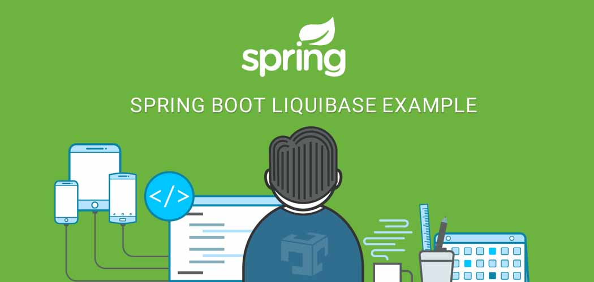

ก่อนจะเริ่มต้น อย่างน้อยควรจะมีพื้นฐานและเคยใช้ Sprig Boot , SQL มาบ้างไม่มากก็น้อย 

# Liquibase คืออะไร ?

เป็นเครื่องมือที่ช่วยจัดการในส่วนของ Database ไม่ว่าจะเป็น Insert , Update , Delete ข้อมูล หรือ Create , Drop , Alter  ตาราง หรือ Add , Drop , Alter คอลัมน์ และอื่นๆ อยู่ในรูปแบบของ XML จะ Auto run script ทุกครั้งที่มีการ Start project

# ทำไมต้องใช้ Liquibase ?

ไม่ต้องมาคอยจัดการ Script database ทุกครั้งที่มีการ Deploy SIT , UAT หรือ Production 

#### ถ้าไม่ใช้ Liquibase ต้องทำไรบ้าง ?
1. หลังจาก Run script SQL บน Dev แล้วต้องมีการจัดเก็บ Script ส่วนนี้ไว้ทุกครั้ง โดยต้องมีที่จัดเก็บให้เป็นระเบียบ และมีโอกาสที่ Developer จะลืมหรือตกหล่นไปบาง Script ด้วย
2. หลังจาก ​Deploy แล้วต้องนำ Script ที่เตรียมไว้มา Run อีกรอบบน Environment นั้นๆ ขั้นตอนนี้มีโอกาสที่จะนำมา Script มา Run ไม่ครบ หรือ Run ผิด Sequence

ลองคิดเล่นๆดูนะครับ ถ้าการ Deploy ในรอบนั้น มีอยู่ประมาณ 10 Script และคนที่ Deploy ไม่ใช่ Developer คนนั้นมีหน้าที่แค่เอาทุกอย่างที่เตรียมไว้แล้วไป Deploy เมื่อเกิดปัญหาขึ้นมา คงจะเสียเวลาและวุ่นวายน่าดู โดยเฉพาะการ Deploy ที่ Production บางทีอาจจะมีเวลาที่จำกัด

ถ้าเราใช้ Liquibase ปัญหาหรือความเสี่ยงต่างๆที่กล่าวมานี้ จะไม่เกิดขึ้นครับ งั้นเรามาเริ่มกันเลยดีกว่า

# 1. ติดตั้ง Dependency 

