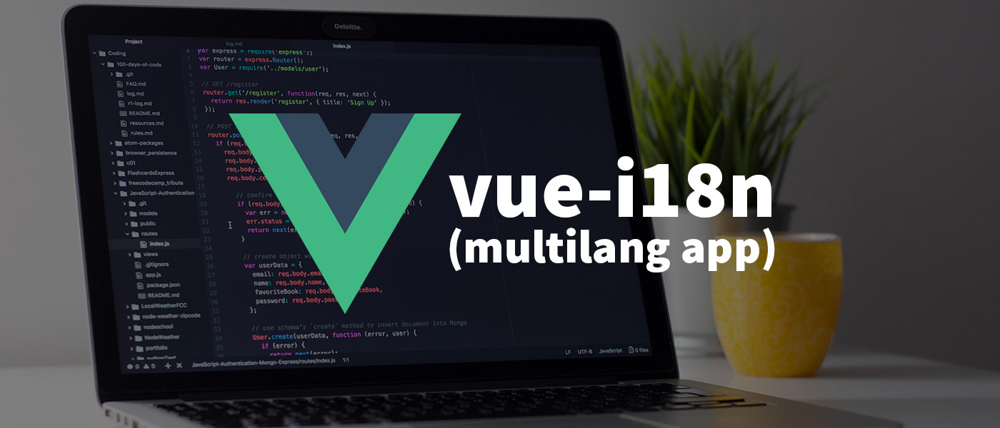
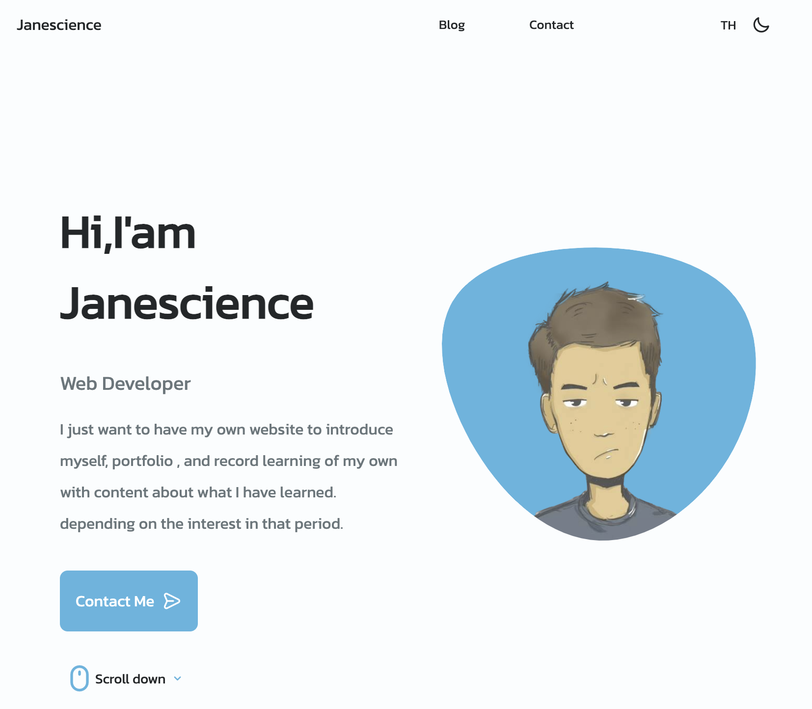
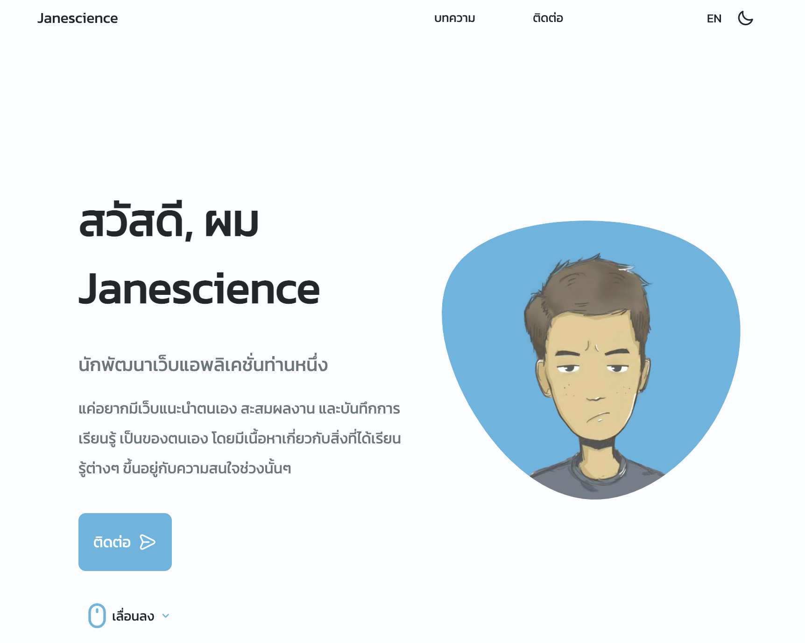

เมื่อผมทำ Website portfolio ด้วย vue.js ไปสักพัก มีความคิดอยากให้เว็บมีภาษาไทยด้วย (ตอนแรกตั้งใจว่าจะทำเว็บเป็นภาษาอังกฤษ) เลยเริ่มหา Tools ที่ง่ายที่สุด อยากให้มันง่ายสะจนกดแล้วให้มันแปลภาษาให้เลย แต่ลองอยู่สักพักไม่น่าจะไหว คงต้องทำแบบแยกเขียน 2 ภาษาแล้ว Switch เอา จนไปเจอ [Vue i18n](https://kazupon.github.io/vue-i18n/installation.html#compatibility-note) มาลองทำไปพร้อมกันเลยครับ

### 1. Install dependency ผ่าน Vue CLI

```bash
$ vue add i18n
```

- ถ้าเราใช้ Git และยังไม่ได้ `commit` vue จะไม่แนะนำให้ติดตั้ง ควรจะ `commit` ก่อน เพราะจะเป็นการ import , เพิ่ม file ให้ Auto แต่ในที่นี้ผมไม่สนใจก็จะตอบ y ไป
```bash
? Still procees? (y/N) y
```

- ถามว่าต้องการให้ภาษา Default เป็นภาษาอะไร ถ้าเราไม่ตอบและ enter เลยจะ Default en มาให้

```bash
? The locale of project localization. (en) 
```

- อีกภาษา เราจะใช้ภาษอะไร ของผมเป็น th
```bash
? The fallback locale of project localization. (en) th
```

- ต้องการให้ Folder ที่เก็บภาษา ชื่อว่าอะไร enter ได้เลยจะ Default มาให้ชื่อ locales
```bash
? The directory where store localization messages of project. It's stored under `src` directory. (locales)
```

- ถ้าตอบ y จะสามารถใช้ `<i18n></i18n>` ใน File .vue ได้เลย สำหรับเว็บที่มี Component แค่ File เดียว
```bash
? Enable locale messages in Single file components ? (y/N) N 
```

- ต้องการอัพ Version หรือไม่ ?
```bash
? Whether to set up a birdge to migrate to vue-i18n@v9.x from vue-i18n@v8.26 ? (y/N) N
```


### 2. เมื่อ Install เสร็จแล้วจะสังเกตุเห็นว่ามีไฟล์เพิ่มขึ้นมา และบางไฟล์ถูกแก้ไข

vue.config.js - สำหรับตั้งค่าต่างๆของ Plugin ไม่ต้องแก้ไขอะไร

```json
pluginOptions: {
    i18n: {
      locale: 'en',
      fallbackLocale: 'th',
      localeDir: 'locales',
      enableInSFC: true,
      enableBridge: false
    }
}
```

.env - ตัวแปร Global

```bash
VUE_APP_I18N_LOCALE=en
VUE_APP_I18N_FALLBACK_LOCALE=th

```

src/main.js - import & use

```js
import i18n from './i18n'
.
.
.
new Vue({
  ...
  i18n,
  render: h => h(App)
}).$mount('#app')
```

src/i18n.js - เป็น Code ในการ Setup ค่าเริ่มต้น

```js
import Vue from 'vue'
import VueI18n from 'vue-i18n'

Vue.use(VueI18n)

function loadLocaleMessages () {
  const locales = require.context('./locales', true, /[A-Za-z0-9-_,\s]+\.json$/i)
  const messages = {}
  locales.keys().forEach(key => {
    const matched = key.match(/([A-Za-z0-9-_]+)\./i)
    if (matched && matched.length > 1) {
      const locale = matched[1]
      messages[locale] = locales(key)
    }
  })
  return messages
}

export default new VueI18n({
  locale: process.env.VUE_APP_I18N_LOCALE || 'en',
  fallbackLocale: process.env.VUE_APP_I18N_FALLBACK_LOCALE || 'en',
  messages: loadLocaleMessages()
})

```

src/locales/en.json - ในโฟลเดอร์จะเก็บภาษาทั้งหมดไว้ เริ่มต้นมาจะเป็น en โดยแยกภาษาออกตามชื่อไฟล์ เอาไว้สำหรับ Switch


```json
{
  "message": "hello i18n !!"
}
```

src/components/Helloi18n.vue - ไฟล์ Example การใช้งาน
```js
<template>
  <p>{{ $t('hello') }}</p>
</template>

<script>
export default {
  name: 'HelloI18n'
}
</script>

<i18n>
{
  "en": {
    "hello": "Hello i18n in SFC!"
  }
}
</i18n>

```

3. เพิ่มไฟล์ locales/th.json ไฟล์นี้เราจะเก็บส่วนที่เป็นภาษาไทย จะได้แบบนี้
  
```json
"home" : {
  "title" : "สวัสดี, ผม Janescience",
  "subtitle" : "นักพัฒนาเว็บแอพลิเคชั่นท่านหนึ่ง",
  "description" : "แค่อยากมีเว็บแนะนำตนเอง สะสมผลงาน และบันทึกการเรียนรู้ เป็นของตนเอง โดยมีเนื้อหาเกี่ยวกับสิ่งที่ได้เรียนรู้ต่างๆ ขึ้นอยู่กับความสนใจช่วงนั้นๆ",
  "btnContact" : "ติดต่อ",
  "btnScrollDown" : "เลื่อนลง"
},
```

4. แก้ไขไฟล์ locales/en.json จะเห็นว่าเราต้องใช้ Key ที่ชื่อเหมือนกัน

```json
"home" : {
  "title" : "Hi,I'am Janescience",
  "subtitle" : "Web Developer",
  "description" : "I just want to have my own website to introduce myself, portfolio , and record learning of my own with content about what I have learned. depending on the interest in that period.",
  "btnContact" : "Contact Me",
  "btnScrollDown" : "Scroll down"
},
```

5. สร้าง Function สำหรับเอาไว้ Switch ภาษา เมื่อกำหนดค่าจะวิ่งไปอ่านไฟล์ locales/{this.$i18n.locale}.json

```js
methods: {
  // สามารถเข้าถึงตัวแปรนี้ที่ไหนก็ได้ใน Project และกำหนดภาษาให้มัน
  switchLocale() {
      if (this.$i18n.locale !== 'en') {
          this.$i18n.locale = 'en';
      }else{
          this.$i18n.locale = 'th';
      }
  }
}
```

6. ส่วน Html เราจะให้มันแสดงผลแบบนี้ และเมื่อ Click ให้ไป Call switchLocale()

```html
<button @click="switchLocale()">
  {{ this.$i18n.locale == 'en' ? 'TH' : 'EN' }}
</button>
```

7. ปรับการแสดงผลใน HTML มาใช้ตัวแปรในไฟล์ .json แทน
   
```html
<div class="home__data">
  <h1 class="home__title">{{ $t("home.title") }}</h1>
  <h3 class="home__subtitle">{{ $t("home.subtitle") }}</h3>
  <p class="home__description">{{ $t("home.description") }}</p>
  <Button 
      href="/contact" 
      :content="$t('home.btnContact')" 
      icon="uil-message">
  </Button>
</div>

 <div class="home__scroll">
    <a href="#about" class="home__scroll-button button--flex">
        <i class="uil uil-mouse-alt home__scroll-mouse"></i>
        <span class="home__scroll-name">{{ $t("home.btnScrollDown") }}</span>
        <i class="uil uil-angle-down home__scroll-arrow"></i>
    </a>
</div>
```
8. ลองใช้งาน โดยการคลิกปุ่มเปลี่ยนภาษา เมื่อเราอยู่ในโหมด EN ปุ่มจะแสดงคำว่า TH สลับกัน
​​
EN


TH


จะเห็นว่าเราแทบไม่ต้อง Config อะไรยุ่งยากเลยครับ ได้เว็บ 2 ภาษาตามที่ต้องการแล้ว 👏🏻 หวังว่าจะเป็นประโยชน์ไม่มากก็น้อยนะครับ 😁